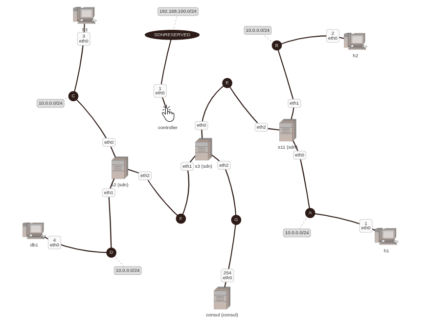

The full HashiCups app reference architecture, which shows the rules needed to be implemented on switches in order for which service to perform a service discovery. Designed to run on the Kathara machine. 




## Run
```
sudo ./prepare.sh
./run.sh
```

Best proof it works:
```
sudo docker exec <container_id> curl -Ss -X POST localhost:20863/api -H "Content-Type: application/json" --data '{"operationName":"GetCoffees", "variables":{},"query":"query GetCoffees {\n  coffees {\n    id\n    name\n    image\n    __typename\n  }\n}"}'
```