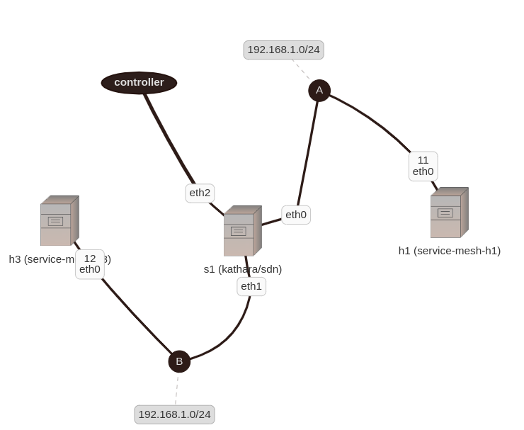

The small subset of HashiCups app reference architecture, just to test simple service discovery. Designed to run on the Kathara machine. 



Switches should replace proxy in service mesh architectures. This is a simple lab designed show single upstream translation (192.168.1.250:8080) to the right destination. It leverages OpenFlow conntrack module.
```
ovs-ofctl add-flow s1 "priority=50,tcp,in_port=1,ip_dst=192.168.1.250,tp_dst=8080,action=ct(commit,zone=1,nat(dst=192.168.1.12:13427)),mod_dl_dst:00:00:00:00:00:02,output:2"
ovs-ofctl add-flow s1 "priority=50,tcp,in_port=2,ct_state=-trk,action=ct(table=0,zone=1,nat)"
ovs-ofctl add-flow s1 "priority=50,tcp,in_port=2,ip_dst=192.168.1.11,ct_state=+est,ct_zone=1,action=1"
```

## Running
```
sudo ./prepare.sh
./run.sh
```

To test on h1 call:
```
curl 192.168.1.250:8080
```

The response should be ok.